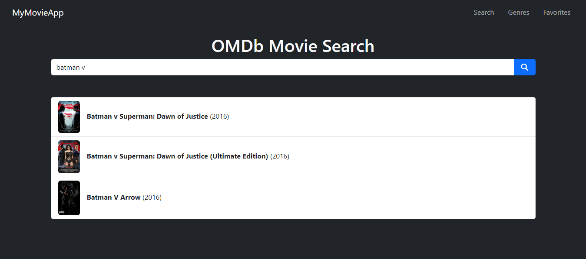
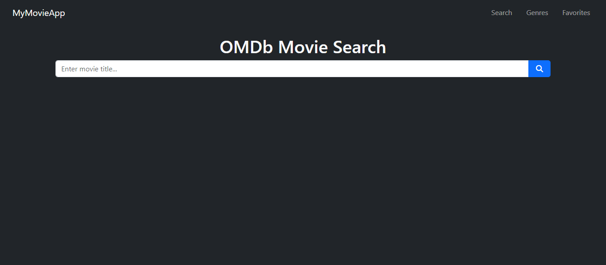
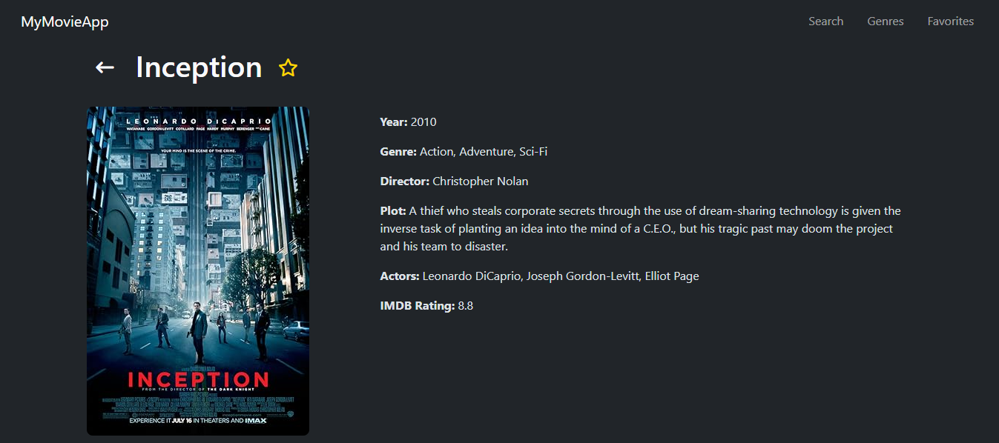
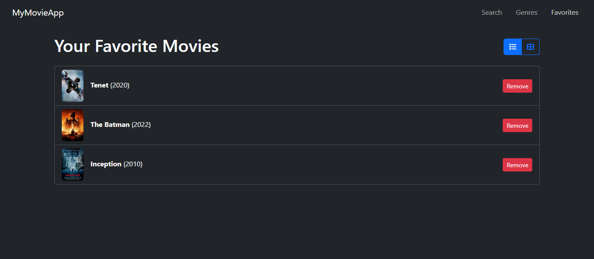
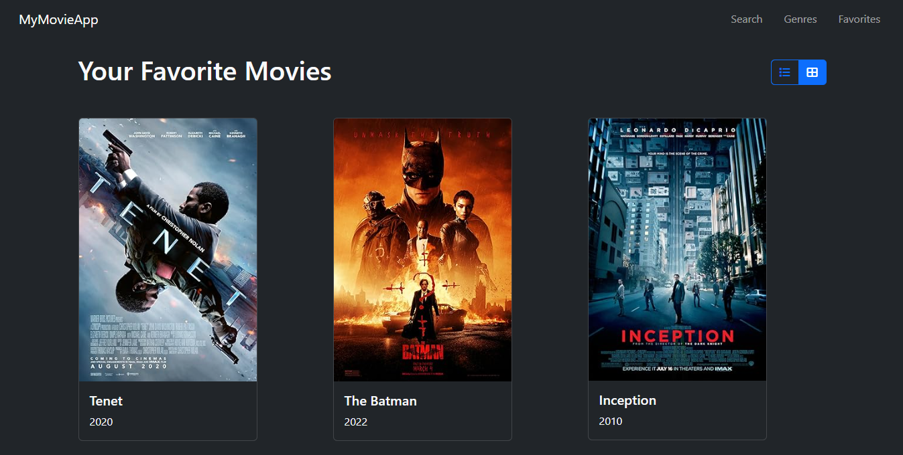

# Proyecto Angular Movies - Sitio de Peliculas

Aplicacion web desarrollada en Angular que permite la busqueda y visualizacion de informacion detallada de diferentes peliculas utilizando la API de OMDb. La aplicacion ofrece una experiencia de usuario fluida y responsiva, ideal para los entusiastas del cine.

## Tabla de Contenidos

- [Características](#características)
- [Capturas de Pantalla](#capturas-de-pantalla)
- [Tecnologías Utilizadas](#tecnologías-utilizadas)
- [Instalación](#instalación)
- [Uso](#uso)
- [API Utilizada](#api-utilizada)
- [Objetivos del Proyecto](#objetivos-del-proyecto)
- [Contribución](#contribución)
- [Licencia](#licencia)

## Características

- **Búsqueda dinámica:** Encuentra películas de manera rápida ingresando el título en la barra de búsqueda.
- **Vista de detalles:** Visualiza información detallada de cada película, incluyendo sinopsis, director, elenco, año de lanzamiento, entre otros.
- **Navegación fluida:** Navega entre los resultados de búsqueda y detalles de manera intuitiva y eficiente.
- **Responsive design:** Diseño adaptable para garantizar una experiencia de usuario óptima en dispositivos móviles y de escritorio.

## Capturas de Pantalla

A continuación, se presentan algunas capturas de pantalla que muestran diferentes vistas y funcionalidades de la aplicación:

### Página Principal

### Resultados de Búsqueda

### Detalles de la Película

### Página de Favoritos - Vista en Modo Listado

### Página de Favoritos - Vista en Modo Cuadricula

## Tecnologías Utilizadas

- **Angular**: Framework utilizado para la construcción de la aplicación.
- **TypeScript**: Lenguaje de programación utilizado en el desarrollo de la lógica de la aplicación.
- **OMDb API**: API utilizada para obtener los datos de las películas.
- **HTML5**: Estructura y contenido de la aplicación.
- **CSS3**: Estilos y diseño de la interfaz de usuario.